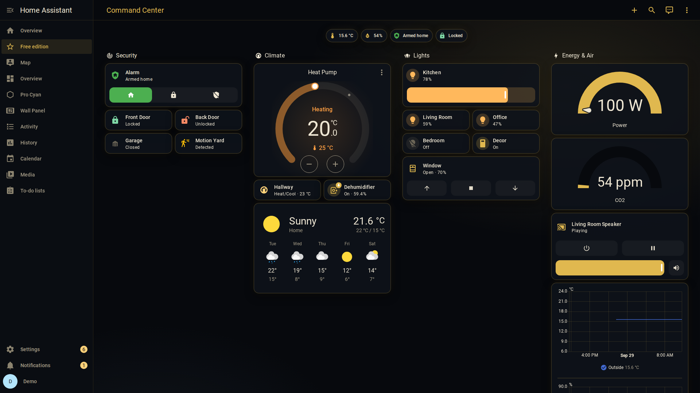
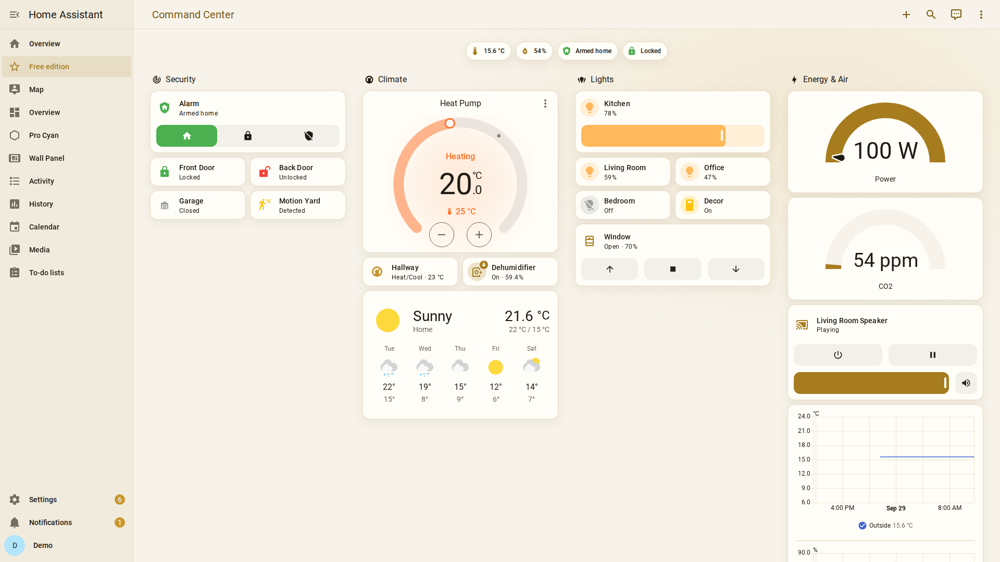
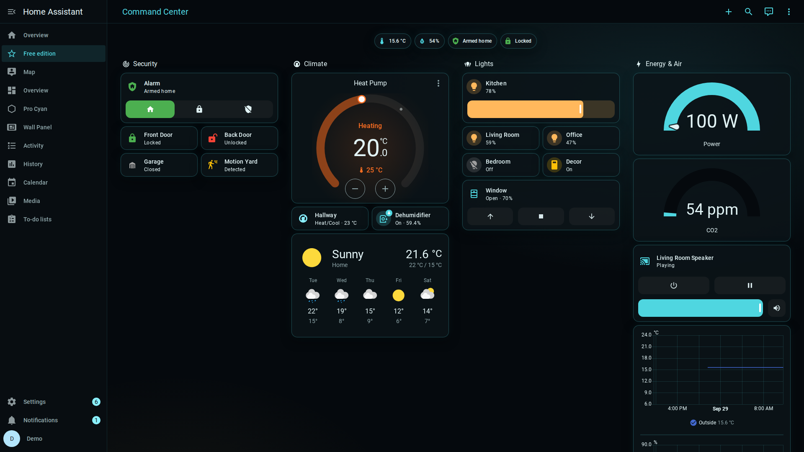
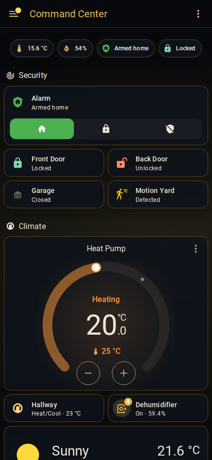

# Aurum HUD (free)

A gold command-center theme for Home Assistant: dark glass cards with a thin gold edge, a soft gold glow, gold header
and sidebar - plus a **light mode**, a **Cyan** variant and a ready example dashboard.
Only built-in Home Assistant features: no custom cards, no card-mod, nothing loaded from the internet.



| Light mode | Cyan | Phone |
|---|---|---|
|  |  |  |

*Screenshots use Home Assistant's demo devices.*

## What you get
- **Aurum HUD** (dark + light) and **Aurum HUD Cyan** - one theme file, `themes/aurum_hud.yaml`.
- **Command Center** example dashboard (`dashboards/command-center.yaml`): security, climate + weather, lights,
  energy + air, media - built from standard cards (sections view, tiles, thermostat, gauges, weather).
- Works on desktop, tablet and the Home Assistant app. Needs Home Assistant 2024.11 or newer (tested on 2026.9.4).

## Install with HACS (custom repository)
1. Make sure your `configuration.yaml` loads themes (add this once, then restart Home Assistant):
   ```yaml
   frontend:
     themes: !include_dir_merge_named themes
   ```
2. HACS > three dots (top right) > **Custom repositories** > Repository: `https://github.com/andrikos1325/aurum-hud`,
   Type: **Theme** > Add.
3. Search HACS for **Aurum HUD** > Download.
4. Developer tools > Actions > `frontend.reload_themes` (or restart Home Assistant).
5. Your profile (bottom left) > Theme: **Aurum HUD** or **Aurum HUD Cyan**, mode Dark or Light.

## Manual install
Copy `themes/aurum_hud.yaml` into `/config/themes/`, add the `frontend:` lines above, restart, pick the theme in your
profile.

## Example dashboard
Settings > Dashboards > Add dashboard > "New dashboard from scratch" > open it > pencil > three dots >
**Raw configuration editor** > paste `dashboards/command-center.yaml` > Save. Then replace the example entity IDs
(like `light.kitchen_lights`) with your own - cards without a matching entity just show a warning until you do.

## Aurum HUD Pro (paid)
Full disclosure: I make and sell a Pro edition. It adds the full HUD look - corner brackets, glowing edges, fine
scanlines, a HUD grid, an **animated ring header** with your alarm / temperatures / power, gold gauges, a wall-tablet
layout and an OLED black theme - still without any custom cards.
**[Aurum HUD Pro on Gumroad](https://antrikos.gumroad.com/l/aurum-hud-pro)** (EUR 7). The free edition stays free and
maintained either way.

## Notes
- Made with AI assistance: the theme values, dashboard YAML and texts were written with AI help and then tested and
  fixed by me on a real Home Assistant 2026.9.4 instance.
- Not affiliated with or endorsed by Home Assistant / Nabu Casa.
- Issues and suggestions are welcome (GitHub Issues).
- Licence: MIT (see `LICENSE`).
